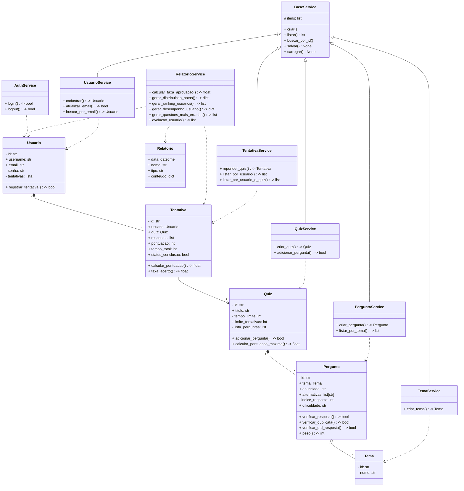

# Sistema de Quiz Educacional

## Descrição do Projeto
O Sistema de Quiz Educacional é um projeto que permite que os Usuários respondam e criem quizzes com título, perguntas, número máximo de tentativas e tempo limite. O Usuário poderá cadastrar perguntas de múltipla escolha, cada uma com um enunciado, alternativas, nível de dificuldade (Fácil, Médio e Difícil) e tema. Além disso, o Usuário poderá gerar diferentes tipos de relatórios que podem fornecer o seu desempenho no Quiz, ranking de usuários e evolução do desempenho do Usuário.

## Objetivo
Desenvolver um sistema que permita que Usuários possam criar, gerenciar e responder quizzes com perguntas de múltipla escolha, fornecendo pontuação, desempenho e evolução.

# Diagrama de Classes

# Lista das Classes

* Tema
* Quiz
* Pergunta
* Usuário
* Tentativa
* Relatório
* BaseService
* QuizService
* TemaService
* UsuarioService
* PerguntaService
* TentativaService
* RelatorioService
* AuthService 
